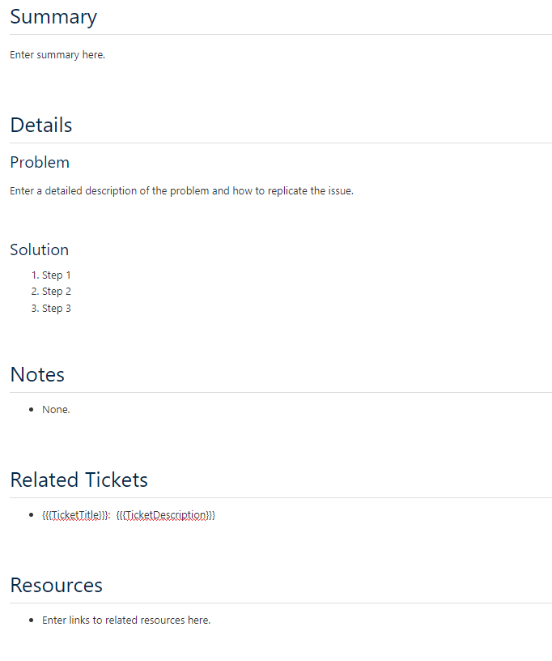
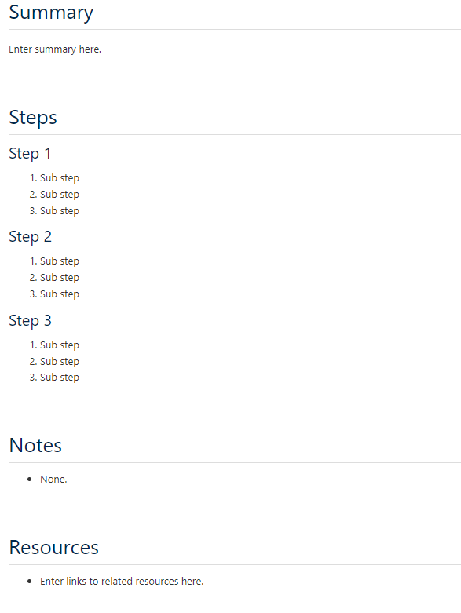

# Knowledge Article Templates

### How-To Articles
Templates for how-to articles, processes, and other step by step instructions.  

#### [Problem-Solution Troubleshooting](https://github.com/DepressionCenter/EFDC-TDX-KB/blob/main/ArticleTemplates/How-To-Articles/Problem-Solution-Troubleshooting.html)
Template for documenting a specific problem and how to solve it. If there are related tickets or widespread events, add links to the Resources section.  

  

#### [Step-by-Step Process](https://github.com/DepressionCenter/EFDC-TDX-KB/blob/main/ArticleTemplates/How-To-Articles/Step-by-Step-Process.html)
How-to article template to document a process or series of steps to accomplish a task.  

  

  

----

Copyright © 2023 The Regents of the University of Michigan
