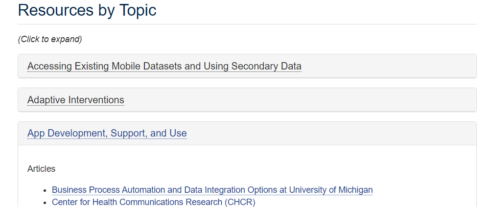
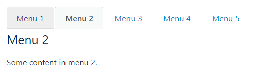
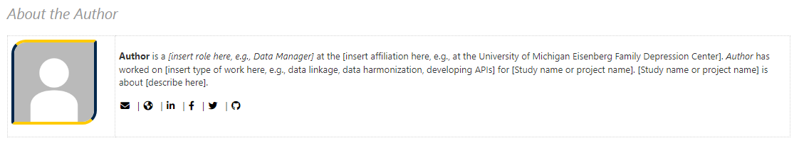
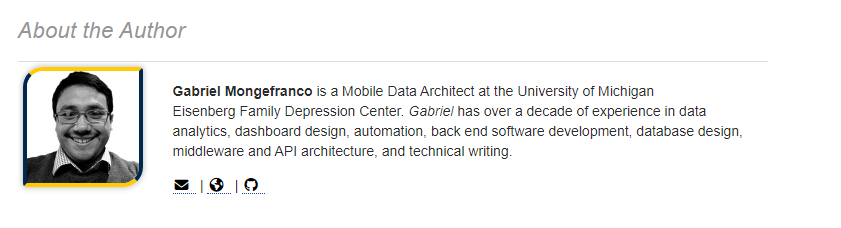

# Knowledge Article Templates

### Mini Sections
Small components that can be added anywhere in an article, including buttons, tabbed pages, accordions, and more.  

  

#### [Accordion Panels](https://github.com/DepressionCenter/EFDC-TDX-KB/blob/main/ArticleTemplates/Mini-Sections/Accordion-Panels.html)
Use this template to create accordion sections, which show a section title that users can click to expand and show more information.  
  

#### [Action Button](https://github.com/DepressionCenter/EFDC-TDX-KB/blob/main/ArticleTemplates/Mini-Sections/Action-Button.html)
Inserts a primary button (yellow). Use the hyperlink in the toolbar to change both the text and where it links.  

#### [Carousel Slider](https://github.com/DepressionCenter/EFDC-TDX-KB/blob/main/ArticleTemplates/Mini-Sections/Carousel-Slider.html)
Template for a "carousel" component which automatically slides content side to side, and includes navigation arrows on the left and on the right.
  

#### [Large Action Button](https://github.com/DepressionCenter/EFDC-TDX-KB/blob/main/ArticleTemplates/Mini-Sections/Large-Action-Button.html)
Inserts a large primary button (yellow) with a fontawesome icon.  

#### [Learn More Button](https://github.com/DepressionCenter/EFDC-TDX-KB/blob/main/ArticleTemplates/Mini-Sections/Learn-More-Button.html)
Inserts an "information" button. Use the hyperlink in the toolbar to change both the text and where it links.  

#### [Tabbed Content](https://github.com/DepressionCenter/EFDC-TDX-KB/blob/main/ArticleTemplates/Mini-Sections/Tabbed-Content.html)
Adds a tab menu that shows content for the specific tab only.  
  
  

#### [Mini Sections - About the Author](https://github.com/DepressionCenter/EFDC-TDX-KB/tree/main/ArticleTemplates/Mini-Sections/About-the-Author).
Pre-formatted "About the author" text for specific authors.  

  + [Generic About the Author](https://github.com/DepressionCenter/EFDC-TDX-KB/blob/main/ArticleTemplates/Mini-Sections/About-the-Author/_Generic-About-the-Author.html). About the author sub-section, normally placed at the bottom of an article. The author photo should be 120x120px or 240x240px.  
    

+ [Gabriel Mongefranco](https://github.com/DepressionCenter/EFDC-TDX-KB/blob/main/ArticleTemplates/Mini-Sections/About-the-Author/Gabriel-Mongefranco.html). __(Example)__ "About the author" template for Gabriel Mongefranco, with profile picture, short bio, and social media links.  
  

  
  
  

----

Copyright © 2023 The Regents of the University of Michigan
